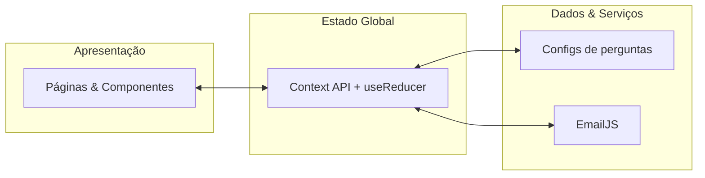
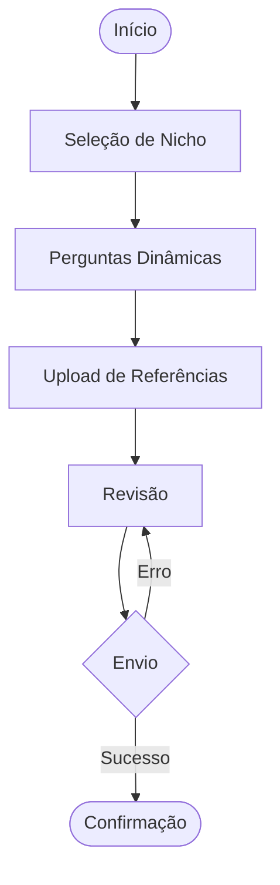

<div align="center">

# ✦ Plataforma de Briefing — Erick Silva

### Uma experiência de coleta de briefing premium, conversacional e inteligente, construída para substituir formulários genéricos de vez.

[](https://react.dev)
[](https://vitejs.dev)
[](https://gsap.com)
[](https://vitest.dev)
[](https://vercel.com)
[](#-licença)

[Demo ao vivo](#) · [Reportar bug](#) · [Sobre o autor](#-autor)

</div>

<br />

<div align="center">
  
  <p><em>Substitua esta imagem por um screenshot real do projeto em produção.</em></p>
</div>

---

## 📖 Índice

- [Sobre o projeto](#-sobre-o-projeto)
- [Funcionalidades](#-funcionalidades)
- [Stack tecnológica](#-stack-tecnológica)
- [Arquitetura](#-arquitetura)
- [Estrutura de pastas](#-estrutura-de-pastas)
- [Como rodar localmente](#-como-rodar-localmente)
- [Variáveis de ambiente](#-variáveis-de-ambiente)
- [Testes](#-testes)
- [Scripts disponíveis](#-scripts-disponíveis)
- [Design System](#-design-system)
- [Acessibilidade](#-acessibilidade)
- [Deploy](#-deploy)
- [Roadmap do projeto](#-roadmap-do-projeto)
- [Autor](#-autor)
- [Licença](#-licença)

---

## 💡 Sobre o projeto

Antes de qualquer projeto de design ou desenvolvimento começar, existe uma pergunta que decide o rumo de tudo: **o que o cliente realmente precisa?**

Formulários genéricos (Google Forms e afins) fazem essa pergunta de um jeito frio, estático e igual para todo mundo — não importa se o cliente quer uma identidade visual, um sistema web ou uma animação de motion design.

Esta plataforma nasceu para resolver isso: um briefing que **se adapta ao tipo de projeto em tempo real**, guia o cliente numa experiência conversacional (poucas perguntas por tela, nunca um formulário intimidador), e entrega tudo organizado, pronto para o primeiro contato ser produtivo desde o minuto zero.

## ✨ Funcionalidades

- 🎯 **Perguntas dinâmicas por nicho** — Identidade Visual, Landing Page, Site Institucional, Sistema Web, Aplicativo, Motion Design, Modelagem 3D e Social Media têm fluxos de perguntas próprios
- 💬 **Experiência conversacional** — nunca mais de 2-3 perguntas por tela, com barra de progresso sempre visível
- 💾 **Salvamento automático** — o cliente pode fechar a aba e retomar de onde parou
- 📎 **Upload de referências** com drag-and-drop
- ✉️ **Envio automático por e-mail**, formatado e organizado por seção
- 🎬 **Microinterações refinadas com GSAP** — entrada do logo, transições entre telas, stagger nos cards
- ♿ **Acessível de verdade** — navegação completa por teclado, contraste WCAG AA, leitor de tela
- 📱 **100% responsivo** — de celulares de 320px a monitores ultrawide
- 🧪 **Testado automaticamente** — lógica de estado e regras de negócio cobertas por testes

## 🛠️ Stack tecnológica

| Camada | Tecnologia |
|---|---|
| Framework | React 18 + Vite |
| Roteamento | React Router v6 |
| Animações | GSAP |
| Estado global | Context API + `useReducer` |
| Estilização | CSS Modules + Design Tokens |
| Envio de e-mail | EmailJS |
| Testes | Vitest + React Testing Library |
| Deploy | Vercel |

## 🏗️ Arquitetura

O projeto segue uma arquitetura em três camadas, com responsabilidades isoladas:



E a jornada do cliente dentro do briefing segue este fluxo:



## 📂 Estrutura de pastas

<details>
<summary>Clique para expandir</summary>

```
src/
├── assets/              → logo, imagens
├── components/
│   ├── ui/               → Button, Input, Select, Card, Badge, Stepper, Modal, Toast, FileDropzone
│   ├── layout/            → Navbar, Logo, PageContainer, ToastViewport
│   └── briefing/          → NicheSelection, QuestionStep, UploadStep, ReviewStep
├── pages/                → Home, Briefing, Success
├── context/               → BriefingContext, ToastContext
├── hooks/                 → useAutosave
├── data/
│   ├── niches.js          → os 8 nichos disponíveis
│   └── questions/         → perguntas universais + por nicho
├── services/              → emailService
├── routes/                → AppRoutes (lazy-loaded)
├── utils/                 → buildFlow, buildReviewSections, formatters, motion
└── styles/                → tokens.css (Design System), global.css
```

</details>

## 🚀 Como rodar localmente

```bash
git clone <url-do-repositório>
cd plataforma-briefing
npm install
cp .env.example .env   # preencha com suas credenciais (veja abaixo)
npm run dev
```

Acesse `http://localhost:5173`.

## 🔐 Variáveis de ambiente

| Variável | Descrição |
|---|---|
| `VITE_EMAILJS_SERVICE_ID` | ID do serviço de e-mail conectado no EmailJS |
| `VITE_EMAILJS_TEMPLATE_ID` | ID do template de e-mail |
| `VITE_EMAILJS_PUBLIC_KEY` | Chave pública da sua conta EmailJS |

Veja o passo a passo completo de configuração do EmailJS mais abaixo, na seção de scripts, ou no histórico de commits do projeto.

## 🧪 Testes

```bash
npm run test:run   # roda todos os testes uma vez
npm test            # modo watch, re-roda a cada alteração
```

Cobertura atual: reducer de estado global, motor de montagem do fluxo de perguntas, geração das seções de revisão (incluindo teste de regressão contra vazamento de respostas entre nichos), formatação de arquivos, componente `Stepper` e smoke test de renderização da aplicação.

## 📦 Scripts disponíveis

| Comando | O que faz |
|---|---|
| `npm run dev` | Inicia o servidor de desenvolvimento |
| `npm run build` | Gera a build de produção em `dist/` |
| `npm run preview` | Serve a build de produção localmente |
| `npm run lint` | Roda o ESLint |
| `npm run test:run` | Roda todos os testes uma vez |
| `npm test` | Roda os testes em modo watch |

## 🎨 Design System

Paleta autoral, dourado clássico sobre grafite suave — nada de tons "padrão de framework":

| Token | Cor | Uso |
|---|---|---|
| `--gold-500` | `#D4AF37` | Cor de marca, CTAs, destaques |
| `--surface-0` | `#1C1C20` | Fundo base |
| `--surface-1` | `#232328` | Cards, inputs |
| `--text-primary` | `#F5F5F4` | Texto principal |
| `--danger` / `--success` / `--info` | — | Estados semânticos, com contraste WCAG AA auditado |

Tipografia: **Manrope** (títulos) + **Inter** (interface e formulários).

## ♿ Acessibilidade

- Navegação 100% funcional só com teclado (Tab, Enter, Espaço, Esc)
- Contraste de texto auditado e corrigido para WCAG AA (4.5:1)
- Mudança de etapa anunciada via `aria-live` para leitores de tela
- Gerenciamento de foco em modais (entra ao abrir, retorna ao fechar)
- Respeita `prefers-reduced-motion`

## ☁️ Deploy

Hospedado na **Vercel**, com deploy automático a cada push na branch principal. O arquivo `vercel.json` garante que todas as rotas do React Router funcionem corretamente em produção (rewrite para `index.html`).

## 🗺️ Roadmap do projeto

<details>
<summary>As 15 etapas de construção deste projeto</summary>

- [x] 01 — Planejamento & Descoberta
- [x] 02 — Wireframe & Fluxo de Telas
- [x] 03 — Arquitetura de Software
- [x] 04 — Design System
- [x] 05 — Setup do Projeto
- [x] 06 — Componentes Base (UI Kit)
- [x] 07 — Motor do Briefing Inteligente
- [x] 08 — GSAP & Microinterações
- [x] 09 — Upload de Arquivos & Drag-and-Drop
- [x] 10 — Envio de E-mail
- [x] 11 — Responsividade Completa
- [x] 12 — Acessibilidade
- [x] 13 — Otimização & Performance
- [x] 14 — Testes & QA
- [x] 15 — Deploy

</details>

## 👤 Autor

**Erick Silva** — Desenvolvedor Full-Stack & Designer

- LinkedIn: [seu link aqui]
- Portfólio: [seu link aqui]
- E-mail: [seu e-mail aqui]

## 📄 Licença

Este projeto é de uso pessoal e comercial de Erick Silva. Todos os direitos reservados.

<div align="center">

---

<sub>Construído com atenção a cada detalhe — do wireframe ao deploy.</sub>

</div>
